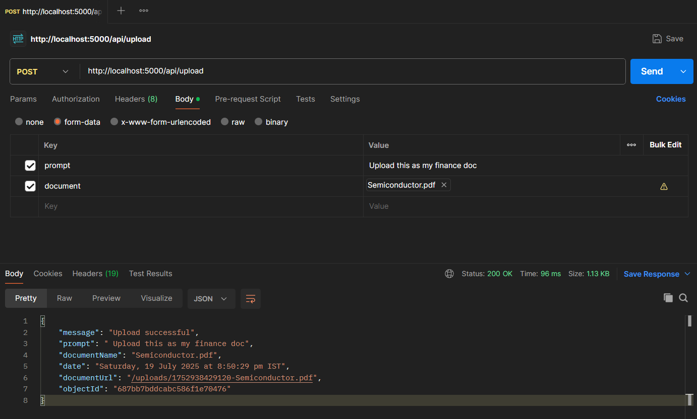

# Mongo Connector

This project provides a connector to interact with MongoDB, enabling data operations such as reading, writing, and updating documents. It is designed for easy integration for the applications requiring MongoDB connectivity.

## Folder Structure

```
mongo_connector/
├── server.js           # Main MongoDB connector logic
├── /uploads            # Files sent as request will be stored.
└── README.md           # Project documentation
```

## Prerequisites

- Node 6.7+
- Atlas MongoDB connectivity (local or remote)

## Installation

1. **Clone the repository:**

   ```bash
   git clone <repo-url>
   cd mongo_connector
   ```

2. **Install dependencies:**

   ```bash
   npm install
   ```

3. **Run Project:**
   ```bash
   npx nodemon server.js
   ```

## Configuration

Edit `.env` to set your MongoDB URI and credentials:

```python
MONGO_URI = "mongodb+srv://<username>:<password>@billing-data.rgnagne.mongodb.net/?retryWrites=true&w=majority&appName=Billing-Data"
```

## Support

For issues, open a GitHub issue in this repository.
OR mailto : skmangle02@gmail.com

## Example: Postman Request Body

Below is an example of how to format a request body in Postman when sending data to the Mongo Connector API:



_Ensure your request body is set to `form-data` and use `FILE` format for document attribute._
